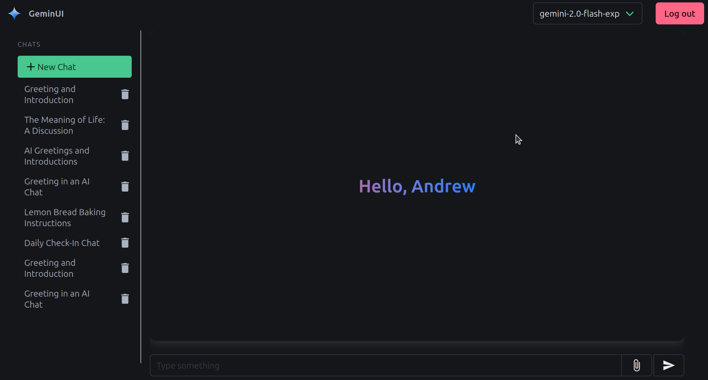
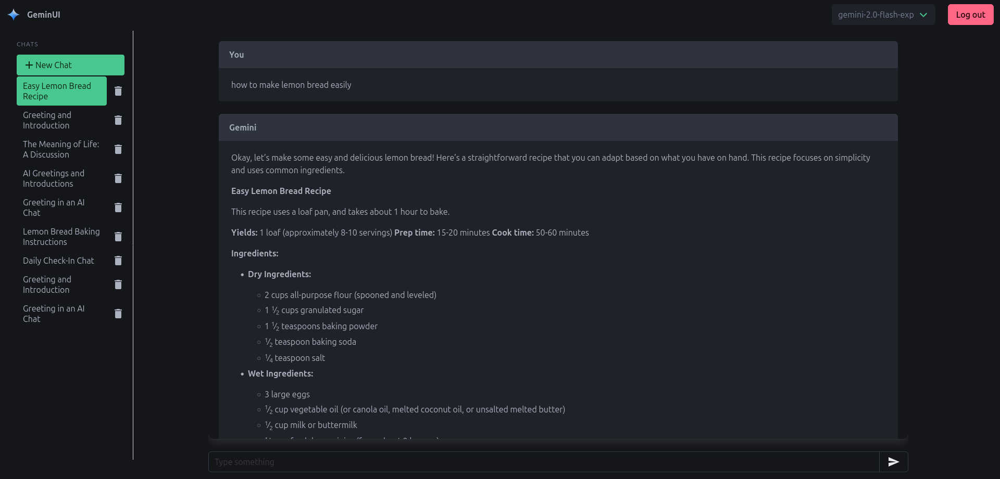

# GeminUI

**Warning:** This is not a production-ready application. I have not had the time to develop it into a fully fledged web app, but I hope to do that in the future.

I had the need to use some AI models at school, particularly the Google Gemini models. Unfortunately, my school disallows the use on our personal accounts. I made a web dashboard that lets you use multiple Gemini models (`gemini-1.5-flash-8b`, `gemini-1.5-flash`, `gemini-2.0-flash-exp`) from a simple interface. It's written in Golang, and uses the Bulma CSS framework.




It supports Markdown responses, and renders them in real time as messages come in. It supports a model switcher, and eventually file uploading.

As I have made it for my school, there are settings to restrict it to certain email domains. I have plans for removing this restriction in the future.

## Installation

```sh
$ git clone https://github.com/radeeyate/geminui.git
$ cd geminui
$ go get
$ go build .

# On Linux or MacOS
$ ./geminui

# On Windows
$ geminui.exe
```

Before running it for the first time, you need to add environment variables. You must have a MongoDB database, Gemini API key, and Mailjet API key to proceed.

This is the format of the `.env` file:
```env
GEMINI_API_KEY = "your gemini api key"
CONNECTION_STRING="your mongodb connection string"
SECRET="a2ed92392e2bc1fa34ba84f3755... you can put whatever you want in here. make it secure."
EMAIL_DOMAIN = "gmail.com"
MAILJET_PUBLIC = "your mailjet public key"
MAILJET_PRIVATE = "your mailjet private key"
EMAIL_SENDER = "your sender address (e.g. noreply@yourdomain.com)"
TIMEZONE = "your timezone (e.g. America/Denver)"
```

## License

MIT License (see LICENSE.md)